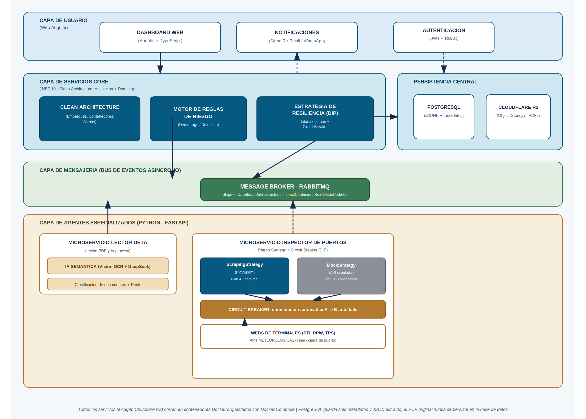

<div align="center">

# PortIA

### Sistema de Gestión de Contenedores y Alertas de Multas Portuarias


**Proyecto Capstone · Ingeniería en Informática · Duoc UC**

</div>

---

## Integrantes

| Integrante | Rol principal |
|---|---|
| **Ignacio Andrade** | Arquitectura de software y Core (.NET 10 / N-Capas) |
| **Nicolas Soto** | Frontend Web (Angular) |
| **Airon Saez** | Agentes de Inteligencia Artificial (Python / FastAPI) |

Profesor guía: Felipe Antonio Krauss Benavente.

---

## Descripción

### ¿Qué es PortIA?

PortIA es un dashboard de control en tiempo real: el asistente que unifica el seguimiento de contenedores marítimos para encargados de Comercio Exterior. A través de un sistema de semáforos y alertas push, consolida cuatro "verdades" que hoy no coinciden entre sí; la **Documental** (lo que dice el PDF), la **Marítima** (dónde está realmente el barco), la **Portuaria** (lo que registra el terminal) y la **Administrativa** (el estado ante la Aduana) en una sola pantalla. Permite visualizar estados críticos y disparar flujos de trabajo, como la redacción de correos automáticos al agente de aduana, con un solo clic.

### ¿A quién va dirigido?

A encargados de Comercio Exterior en empresas importadoras grandes, que manejan entre 30 y 100 contenedores simultáneamente y que hoy sufren una alta carga cognitiva coordinando la logística mediante Excel, correos y WhatsApp.

### ¿Qué problema resuelve?

El ecosistema de comercio exterior chileno opera con infraestructura de datos fragmentada. La información vital está atrapada en PDFs mutantes los Bill of Lading, con formato distinto por cada naviera o en silos de los Forwarders (agentes de carga). Esta dependencia de actualizar manualmente un Excel, con cientos de acciones manuales al mes, provoca errores de desfase que se traducen en multas de **Demurrage** y **Detention**.

PortIA resuelve esto al:

- Eliminar el ojo humano del rastreo, consolidando la información extraída automáticamente por IA.
- Notificar proactivamente, con una latencia objetivo menor a 60 segundos, cuando un contenedor entra en estado crítico.
- Actuar como un puente de acción: generar y dejar lista para aprobación humana cualquier comunicación oficial (nunca se envía nada de forma autónoma).

---

## Arquitectura de la solución

PortIA está construido bajo **N-Capas** sobre .NET 10, aplicando el **Principio de Inversión de Dependencias (DIP)** y el **patrón Strategy** para aislar el núcleo de negocio de las integraciones externas más volátiles: la lectura de documentos y la conexión con los terminales portuarios.

El punto más importante de la arquitectura es la **estrategia dual de verificación portuaria**: el sistema intenta primero obtener el estado real de un contenedor mediante *web scraping* (`ScrapingStrategy`, con Playwright) contra el portal del terminal. Si esa estrategia falla el portal cambia, se cae, o bloquea la IP, un mecanismo de **Circuit Breaker** conmuta automáticamente hacia una estrategia simulada (`MockStrategy`), garantizando que el sistema nunca se detenga por la volatilidad de un tercero.



### Capas del sistema

| Capa | Responsabilidad | Tecnología |
|---|---|---|
| **Usuario** | Dashboard, notificaciones, autenticación | Angular + SignalR |
| **Servicios Core** | Casos de uso, motor de reglas de riesgo, estrategia de resiliencia | .NET 10 · N-Capas |
| **Persistencia** | Metadatos y datos estructurados / objetos binarios (PDFs) | PostgreSQL (JSONB) · Cloudflare R2 |
| **Mensajería** | Bus de eventos asíncrono entre Core y Agentes | RabbitMQ |
| **Agentes especializados** | Lectura IA de documentos, verificación portuaria | Python · FastAPI |

### Principios de diseño aplicados

- **N-Capas**: separación de responsabilidades entre Presentación (WebApi), Servicios, Inyección de Dependencias y Configuración.
- **DIP (Dependency Inversion Principle)**: el Core depende de interfaces, nunca de implementaciones concretas de terceros.
- **Strategy + Circuit Breaker**: resiliencia ante la volatilidad de servicios externos (portales portuarios).
- **Human-in-the-Loop**: ninguna comunicación externa (correos, notificaciones formales) se envía sin aprobación explícita de un usuario.
- **Privacidad por diseño**: el PDF original nunca se persiste en la base de datos relacional; solo se guardan metadatos y datos estructurados, pensando en la Ley N° 21.719 de Protección de Datos Personales (vigente en Chile desde diciembre de 2026).

### Estructura de repositorios del proyecto

PortIA está dividido en tres repositorios independientes, comunicados entre sí mediante colas de mensajería:

| Repositorio | Contenido | Tecnología principal |
|---|---|---|
| **PortIA_Web** *(este repositorio)* | Cliente web, dashboard de control, documentación completa del proyecto | Angular |
| **PortIA_Core** | Orquestador central: ingesta, motor de reglas, notificaciones en tiempo real | .NET 10 / C# |
| **PortIA_Agentes** | Microservicios de IA: lectura de documentos e inspección portuaria | Python |

---

## Tecnologías utilizadas

### Frontend (PortIA_Web)

- **Framework:** Angular
- **Tiempo real:** SignalR (WebSockets) para recibir alertas del semáforo sin recargar la página
- **UI/UX:** diseño orientado a sistema de semáforos de riesgo

### Core (PortIA_Core)

- **Framework:** ASP.NET Core 10
- **Lenguaje:** C#
- **Arquitectura:** N-Capas (PortIA.Core.WebApi / PortIA.Core.Services / PortIA.Core.DependencyInjection / PortIA.Core.Configuration)
- **Base de datos:** PostgreSQL

### Agentes de IA (PortIA_Agentes)

- **Lenguaje:** Python
- **Framework:** FastAPI
- **Modelo de IA:** DeepSeek (extracción de entidades desde documentos)
- **Automatización web:** Playwright (scraping de terminales portuarios)
- **Caché / idempotencia:** Redis

### Infraestructura y datos

- **Mensajería:** RabbitMQ (bus de eventos asíncrono)
- **Almacenamiento de objetos:** Cloudflare R2 (PDFs originales de los Bill of Lading)
- **Contenedores:** Docker y Docker Compose (desarrollo local y producción en VPS propio)
- **Base de datos relacional:** PostgreSQL (metadatos y datos extraídos, en formato JSONB)

---

## Instrucciones para ejecutar el proyecto localmente

> El sistema está dividido en 3 repositorios. Clona los tres (`PortIA_Web`, `PortIA_Core`, `PortIA_Agentes`) dentro de una misma carpeta raíz, al mismo nivel entre ellos.

### Requisitos previos

- [Docker Desktop](https://www.docker.com/products/docker-desktop/)
- [Node.js LTS](https://nodejs.org/) y Angular CLI (`npm install -g @angular/cli`), solo si quieres correr el frontend en modo desarrollo

### 1. Clonar los repositorios

```bash
git clone https://github.com/IgnacioAndrade1609/PortIA_Web.git
git clone https://github.com/IgnacioAndrade1609/PortIA_Core.git
git clone https://github.com/IgnacioAndrade1609/PortIA_Agentes.git
```

Deben quedar los tres en la misma carpeta, al mismo nivel:

```
CAPSTONE/
├── PortIA_Web/
├── PortIA_Core/
└── PortIA_Agentes/
```

### 2. Levantar todo el backend con Docker

El archivo `docker-compose.yml` vive en este mismo repositorio (`PortIA_Web`). Cópialo a la carpeta raíz `CAPSTONE/` (un nivel arriba de los 3 repos) y ejecuta, desde ahí:

```bash
docker-compose up --build
```

Esto levanta 5 contenedores:

| Servicio | Puerto local | Qué es |
|---|---|---|
| `portia-postgres` | `5433` | Base de datos PostgreSQL |
| `portia-minio` | `9000` (API) / `9001` (consola web) | Almacenamiento de objetos (simula Cloudflare R2) |
| `portia-redis` | `6379` | Caché en memoria |
| `portia-core` | `8080` | API del Core en .NET 10 |
| `portia-agentes` | `8000` | Agente de IA en Python (FastAPI) |

> Nota: PostgreSQL corre en el puerto `5433` (no el `5432` estándar) porque suele chocar con instalaciones locales de PostgreSQL ya existentes en el computador.

### 3. Verificar que todo esté corriendo

```bash
docker ps
```

Deberías ver los 5 contenedores con estado `Up`.

- **API del Core (Swagger):** http://localhost:8080/swagger
- **API del Agente (Docs):** http://localhost:8000/docs
- **Consola de MinIO:** http://localhost:9001 (usuario `portia`, contraseña `portia12345`)
- **PostgreSQL:** conéctate con [DBeaver](https://dbeaver.io/) u otro cliente a `localhost:5433`, base `portia_db`, usuario `portia`, contraseña `portia123`

### 4. Levantar el frontend en modo desarrollo

El frontend Angular no está dockerizado (se ejecuta en modo desarrollo):

```bash
cd PortIA_Web
npm install
npm start
```

La aplicación queda disponible en http://localhost:4200

---

## Metodología de trabajo del equipo

El equipo trabaja bajo **Scrum**, con **sprints de dos semanas** a lo largo de las 16 semanas del proyecto. Dentro de cada sprint, y respetando siempre los principios de Clean Architecture, se prioriza entregar una funcionalidad completa de punta a punta (dominio + aplicación + infraestructura) por sobre avanzar capa por capa, para reducir el riesgo de integrar tarde el Core con los Agentes de IA.

- **Tablero de trabajo:** GitHub Projects (Kanban), con columnas *Backlog → En progreso → En revisión → Hecho*.
- **Estrategia de ramas:**
  - `main`: rama bloqueada, nadie puede subir cambios directamente. Solo se actualiza mediante *pull request* (merge request) revisado y aprobado. Representa siempre la última versión estable, la que se presenta en el Capstone.
  - `develop`: también bloqueada, solo se actualiza mediante *pull request*. Es la versión más avanzada del proyecto, integrando lo que cada integrante va terminando; no necesariamente está 100% funcional en todo momento, pero esa es siempre la meta.
  - `feature/[nombre_rama]`: cada integrante trabaja obligatoriamente en su propia rama de funcionalidad (por ejemplo `feature/dashboard-semaforo` o `feature/scraping-strategy`), que luego se integra a `develop` mediante *pull request* revisado por al menos otro integrante del equipo.
  - `tags`: al cierre de cada sprint se crea un *tag* sobre `develop` o `main` según corresponda, como una fotografía de la última versión funcional en ese punto del proyecto. Los tags no reciben cambios directos, son solo una marca de referencia en el tiempo.
- **Entorno reproducible:** todo el stack se levanta con Docker Compose, evitando el clásico problema de "en mi máquina funciona".
- **Seguimiento con el profesor guía:** revisiones periódicas de las decisiones de arquitectura más riesgosas (por ejemplo, la estrategia de scraping vs. Mock), documentadas y usadas como insumo para ajustar el diseño en conjunto.

---

## Documentación adicional

La documentación extendida del proyecto (especificaciones de arquitectura, catálogo de casos de uso, storyboards, análisis de cumplimiento normativo) se encuentra en la carpeta Fase 01/ de este repositorio.

---

## Licencia

Este proyecto se distribuye con fines académicos, en el marco del proceso de Titulación de Ingeniería en Informática de Duoc UC.
